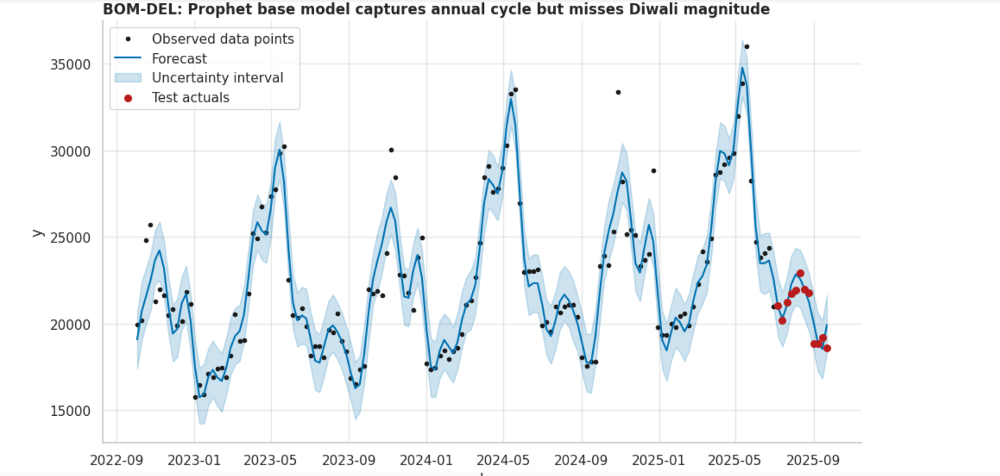
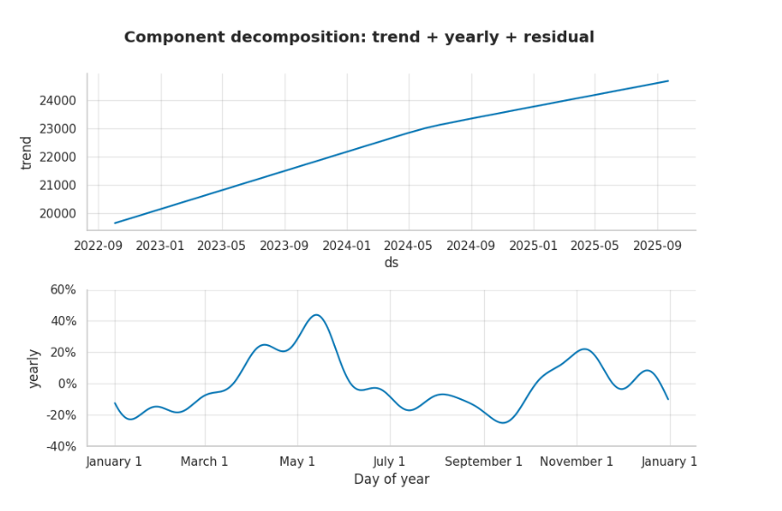
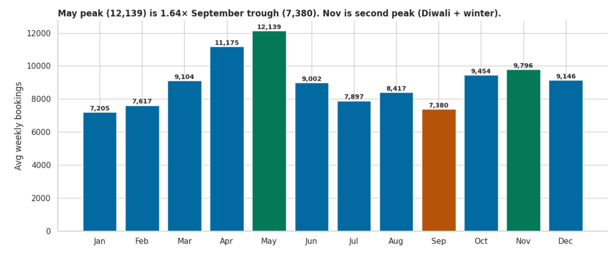

# ✈️ Aero India: Airline Demand Forecasting & Revenue Optimization

## 📌 Project Overview

Aero India is a data analytics and machine learning project designed to forecast airline booking demand and support revenue optimization strategies. The project leverages historical airline booking data, external market factors, and time-series forecasting techniques to predict future passenger demand across different airline routes.

Accurate demand forecasting enables airlines to optimize pricing, improve resource allocation, reduce operational inefficiencies, and maximize revenue.

---

## 🎯 Business Problem

Airlines operate in a highly dynamic environment where passenger demand fluctuates due to seasonal trends, holidays, special events, weather conditions, and economic factors.

Traditional forecasting approaches often fail to capture these complex patterns, resulting in:

* Overbooking or underutilization of flights
* Inefficient pricing strategies
* Revenue leakage
* Poor capacity planning
* Increased operational costs

The objective of this project is to develop a robust forecasting framework that accurately predicts future booking demand and provides actionable business insights.

---

## 📊 Dataset

The analysis uses historical airline booking data containing:

* Booking dates
* Route information
* Passenger volumes
* Revenue metrics
* Seasonal indicators

Additional external variables were incorporated, including:

* Indian public holidays
* IPL schedule effects
* Fuel price trends
* Monsoon season indicators

---

## 🔍 Project Workflow

### 1. Data Collection & Preparation

* Loaded and consolidated airline booking datasets
* Handled missing values and data inconsistencies
* Performed feature engineering for time-based variables

### 2. Exploratory Data Analysis (EDA)

* Analyzed booking trends over time
* Identified seasonality patterns
* Examined route-level demand behavior
* Visualized demand fluctuations and anomalies

### 3. Time Series Analysis

* Seasonal decomposition
* Trend analysis
* Autocorrelation analysis (ACF)
* Stationarity assessment

### 4. Forecasting Model Development

* Implemented Facebook Prophet for demand forecasting
* Integrated holiday and event effects
* Generated future booking predictions
* Evaluated forecast accuracy using MAPE

### 5. Model Validation

* Walk-forward validation
* Residual analysis
* Forecast error evaluation
* Model performance comparison

---

## 🛠️ Technologies Used

* Python
* Pandas
* NumPy
* Matplotlib
* Seaborn
* Prophet
* Statsmodels
* Scikit-learn
* Jupyter Notebook

---

## 📈 Key Findings

* Significant seasonal demand patterns were identified across airline routes.
* Holiday periods generated substantial increases in passenger bookings.
* Diwali showed the strongest positive impact on booking volume.
* External factors such as IPL schedules and fuel prices influenced demand trends.
* Forecasting accuracy improved significantly compared to baseline forecasting approaches.

---

## 🚀 Business Impact

### Forecast Accuracy Improvement

* Reduced forecasting error from **13.5% MAPE to 7.4% MAPE**
* Achieved approximately **45% improvement in prediction accuracy**

### Revenue Optimization

* Improved demand visibility for pricing and capacity planning
* Enabled data-driven yield management decisions
* Estimated potential annual revenue uplift of **₹12 Crore**

### Operational Benefits

* Better flight scheduling
* Improved resource allocation
* Enhanced demand planning
* Reduced forecasting uncertainty

---

## 📊 Sample Outputs

* Demand trend visualizations
* Seasonal decomposition charts
* Holiday impact analysis
* Route-level forecasts
* Forecast accuracy metrics
* Revenue impact assessment

---

## 💡 Skills Demonstrated

* Time Series Forecasting
* Predictive Analytics
* Business Analytics
* Revenue Optimization
* Feature Engineering
* Statistical Analysis
* Data Visualization
* Machine Learning
* Forecast Validation
* Exploratory Data Analysis (EDA)

---
## Forecast Results

## Seasonal Demand Analysis

## Business Impact

## 📌 Future Enhancements

* Real-time demand forecasting pipeline
* Dynamic pricing recommendations
* Integration with live airline booking systems
* Advanced ensemble forecasting models
* Interactive Power BI dashboard

---

## 👨‍💻 Author

**Sharath Chandrika Kodumuri**

Computer Science Engineering Graduate | Data Analytics | Machine Learning | Business Intelligence

Passionate about transforming raw data into actionable business insights through analytics, forecasting, and machine learning.
